# Implementation of deep learning-based crack detection -- CrackSegNet, using Keras

---

## Overview

### Data

Data for training and testing will be released later.
10 test images has been released, and you can find it in folder /test_imgs.

### Data augmentation

The data for training contains 735 512*512 images, which are far not enough to feed a deep learning neural network. I use a module called ImageDataGenerator in keras.preprocessing.image to do data augmentation.

### Model

This deep neural network is implemented with Keras functional API, which makes it extremely easy to experiment with different interesting architectures.

Output from the network is a 512*512 which represents mask that should be learned. Sigmoid activation function makes sure that mask pixels are in \[0, 1\] range.

See model.py for detail.

### Training

The model is trained for at least 40 epochs.

After each epoch, model is saved according to the loss value and accuracy is calculated.

Loss functions for the training are binary crossentropy and modified [Focal Loss](http://arxiv.org/abs/1708.02002).

See model.py for detail.

---

## How to use

### Dependencies

Run:
`pip install -r requirements.txt`

This tutorial depends on the following libraries:

* tensorflow-gpu==1.1.0
* Keras==2.0.9
* h5py==2.6.0
* numpy==1.11.1
* scikit-image==0.12.3
* scikit-learn==0.17.1

Also, this code should be compatible with Python versions 2.7.

### Run test.py

You will see the predicted results of test images in ./output

### Results

Use the trained model to do segmentation on test images, the results are as follows:

| Image | label |
| ------ | ------ |
|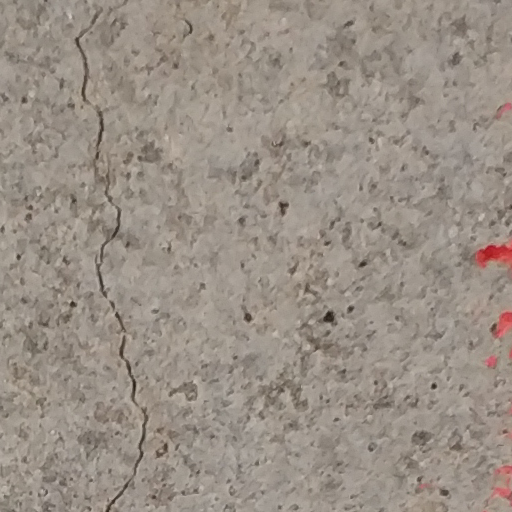 |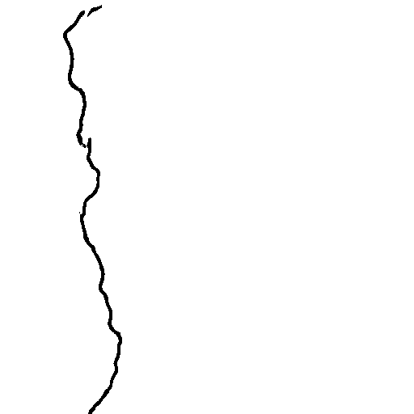|
| |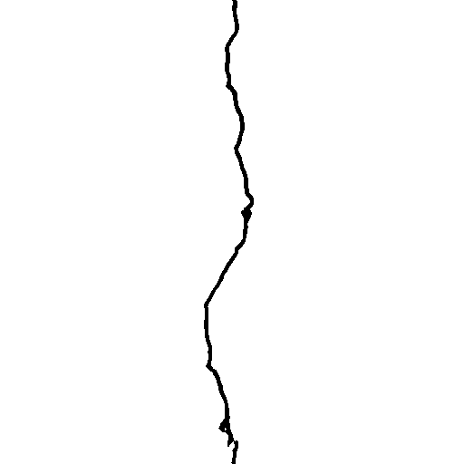|
|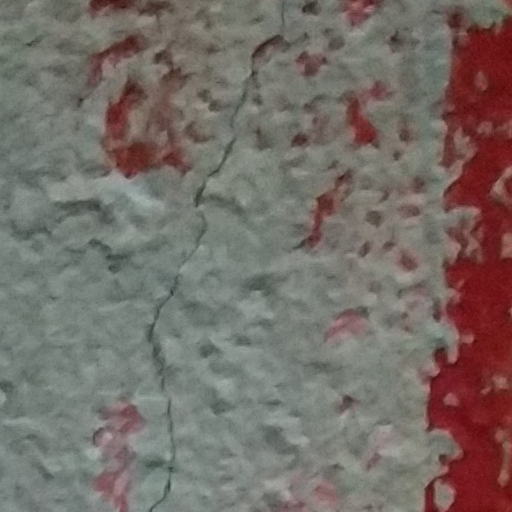 |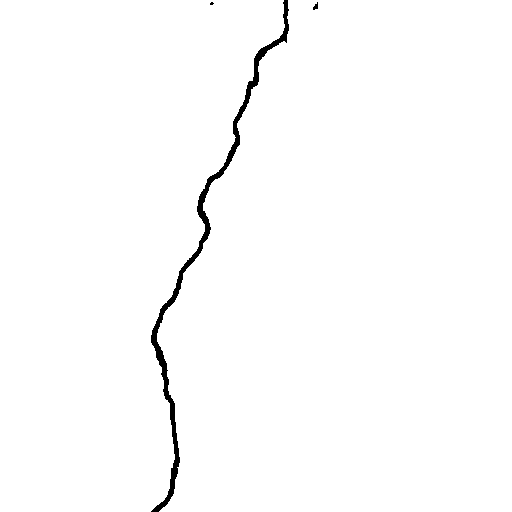|
|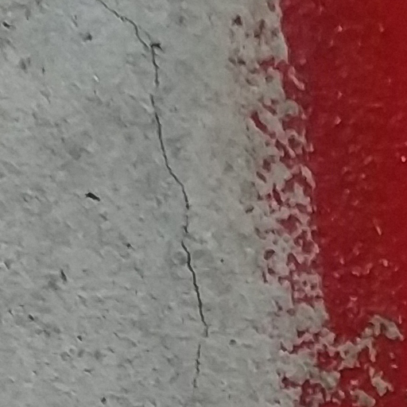 |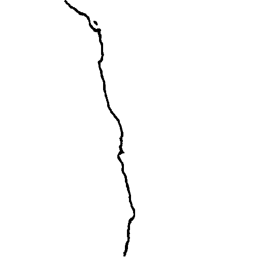|
|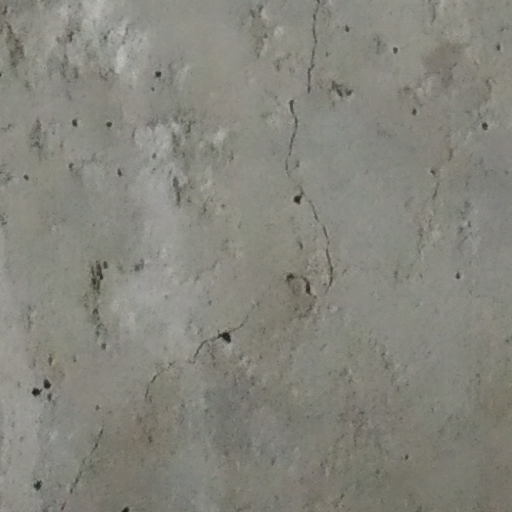 |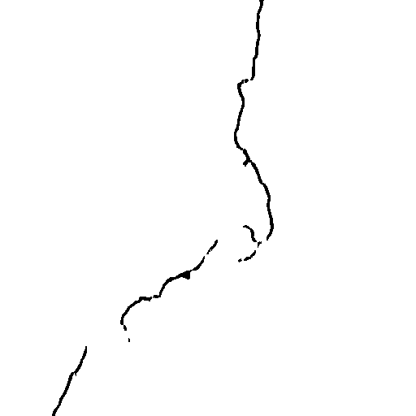|
| |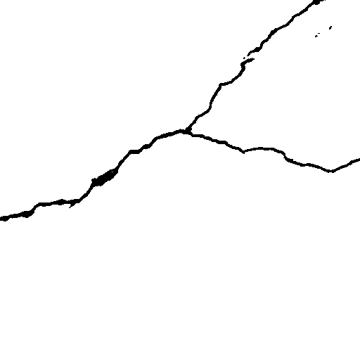|
| |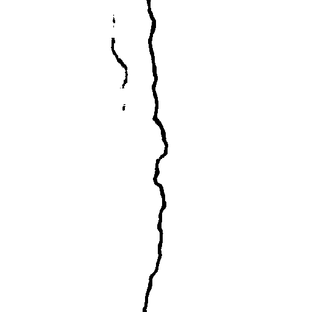|
|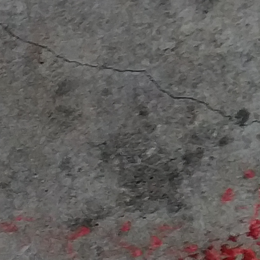 |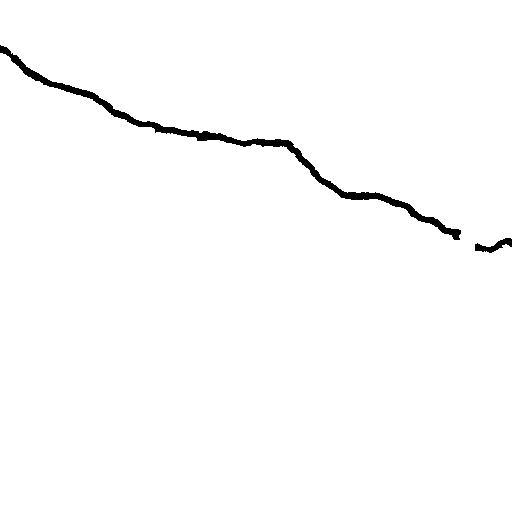|
|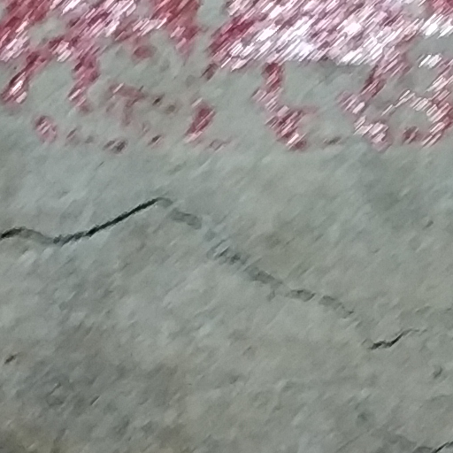 ||
|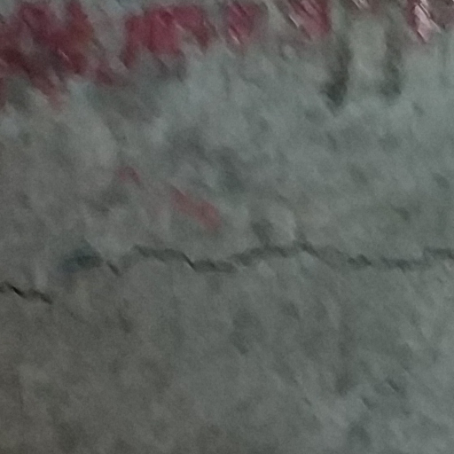 |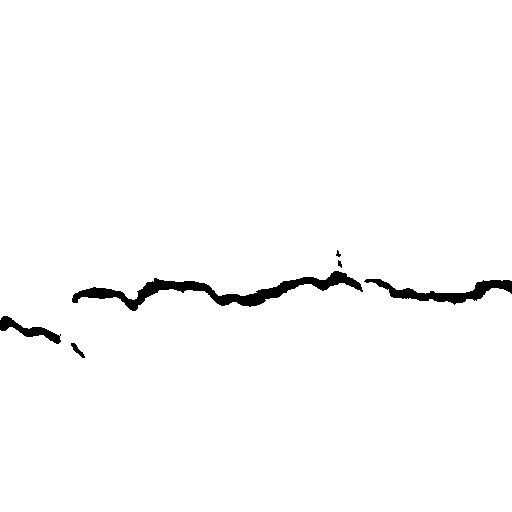|

## About Keras

Keras is a minimalist, highly modular neural networks library, written in Python and capable of running on top of either TensorFlow or Theano. It was developed with a focus on enabling fast experimentation. Being able to go from idea to result with the least possible delay is key to doing good research.

Use Keras if you need a deep learning library that:

allows for easy and fast prototyping (through total modularity, minimalism, and extensibility).
supports both convolutional networks and recurrent networks, as well as combinations of the two.
supports arbitrary connectivity schemes (including multi-input and multi-output training).
runs seamlessly on CPU and GPU.
Read the documentation [Keras.io](http://keras.io/)

Keras is compatible with: Python 2.7-3.5.
